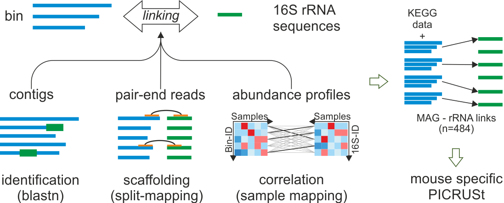

# Linking of reconstructed 16S rRNA genes to bins

## Table of Contents  
[Description](#Description)  
[Requirements](#Requirements)  
[Blast-search](#Blast-search)  
[Split-Mapping](#Split-Mapping)  
[Correlation](#Correlation)  
[Integration](#Integration)  

# Description

# Requirements

* [NCBI Blast](http://ftp.ncbi.nlm.nih.gov/blast/executables/blast+/LATEST/)
* [BBmap](https://sourceforge.net/projects/bbmap/)
* [R](https://cran.r-project.org)

# Blast-search

**1. Create Blast database with reconstructed 16S rRNA sequences from RAMBL**

	makeblastdb -type nucl -in RAMBL-16SrRNAsequences.fasta

**2. Run Blast for all bins ($BinFastaFile)**

	blastn \
	-query $BinFastaFile \
	-db RAMBL-16SrRNAsequences.fasta \
	-max_target_seqs 50 \
	-outfmt 6 \
	-evalue 0.000001 \
	-num_threads 20 \
	-out blastn-bins_Finals-full-nr99.50-hits-fasta.outfmt6
	

**3. Filter Blast results (min ident 97% and min coverage 100bp)**

    cat blastn-bins_Finals-full-nr99.50-hits-fasta.outfmt6 | \
    awk '$3 > 97' | awk '$4 > 100' | cut -f1,2,12 > filtered-BlastOut.tab

**4. Create Blast results matrix**

Needed Input files:
* filtered-BlastOut.tab
* list for all 16SrRNA names in text-format: "16SrRNAnames.txt"
* list for all bin names in text-format: "BinNames.txt"

Run reformat script (iMGMC/linking/reformat-blast-results.sh)

    reformat-blast-results.sh filtered-BlastOut.tab 16SrRNAnames.txt BinNames.txt
    
    #final output: "matrix-Blast.tab"

# Split-Mapping

**1. Create BBmap index for all bins**

	bbsplit.sh ref=${Folder-of-all-bins}

**2. Run BBsplit to split each library into reads mapping to each bin**

    # for each Sample ($SampleName) with ReadR1 ($Fastq_R1) and ReadR2 ($Fastq_R2) we preform:
	mkdir splited-read-${SampleName}
	bbsplit.sh -Xmx80g usejni=t unpigz=t threads=24 minid=0.90 \
	ambiguous2=toss \
	in=${SampleName}_R1_rmhost.fastq.gz \
	in2=${SampleName}_R2_rmhost.fastq.gz \
	basename=./splited-read-${SampleName}/out_%.fastq.gz

**3. Map all mapped reads of a bin to all 16S rRNA sequences from RAMBL**

    mkdir statsfiles-unpaired-all scafstats-statsfiles-unpaired-all \
	cov-statsfiles-unpaired-all rpkm-statsfiles-unpaired-all
	# for each bin ($BinNr) we preform:
	zcat ./splited-read-*/out_bin_${BinNr}.fastq.gz | \
	bbmap.sh local=t -Xmx30g unpigz=t threads=${usedCores} minid=0.90 \
	ref=RAMBL-16sRNAsequences.fasta nodisk \
	interleaved=false \
	statsfile=./statsfiles-unpaired-all/${BinNr}.statsfile \
	scafstats=./scafstats-statsfiles-unpaired-all/${BinNr}.scafstats \
	covstats=./cov-statsfiles-unpaired-all/${BinNr}.covstat \
	rpkm=./rpkm-statsfiles-unpaired-all/${BinNr}.rpkm \
	sortscafs=f nzo=f ambiguous=all \
	in=stdin.fastq

**3. Summarize statistics**

    # run the script in the same directory
	# it use the dir "statsfiles-unpaired-all"
    make-splitmapping-stats.sh
	
	#final output: "final-unambiguousReads.tab"

# Correlation

**1. Create 16S rRNA gene abundances over all samples**

    # for each Sample ($SampleName) with ReadR1 ($Fastq_R1) and ReadR2 ($Fastq_R2) we preform:
    bbmap.sh -Xmx30g unpigz=t threads=${usedCores} minid=0.90 \
    ref=RAMBL-16sRNAsequences.fasta nodisk \
    statsfile=16SrRNA-statsfiles/${SampleName}.statsfile \
    scafstats=16SrRNA-scafstats-statsfiles/${SampleName}.scafstats \
    covstats=16SrRNA-cov-statsfiles/${SampleName}.covstat \
    rpkm=16SrRNA-rpkm-statsfiles/${SampleName}.rpkm \
    sortscafs=f nzo=f ambiguous=all local=t \
	in=${SampleName}_R1_rmhost.fastq.gz \
	in2=${SampleName}_R2_rmhost.fastq.gz

**2. Summarize statistics and create matrix file for 16S rRNA abundances**

    # run the script in the same directory
	# it use the dir "scafstats-statsfiles"
	make-16S-mapping-stats.sh
	
	#final output: "16S-abundances.tab"

**3. Create bin abundances over all samples**

    # create conducted bin-fasta file from all bins in ${Folder-of-all-bins}
	mkdir bin-abundances
	cd bin-abundances
	for bin-file in ${Folder-of-all-bins}
	do
	BinFileName=${bin-file##*/}
	echo ">${BinFileName%.*}" >> bin-sequences.fasta
	fgrep -v ">" $bin-file >> bin-sequences.fasta
	done
	
	# create ref for bbmap
	bbmap.sh ref=bin-sequences.fasta
	
	# for each Sample ($SampleName) with ReadR1 ($Fastq_R1) and ReadR2 ($Fastq_R2) we preform:
	statsfile=bin-statsfiles/${SampleName}.statsfile \
    scafstats=bin-scafstats-statsfiles/${SampleName}.scafstats \
    covstats=bin-cov-statsfiles/${SampleName}.covstat \
    rpkm=bin-rpkm-statsfiles/${SampleName}.rpkm \
    sortscafs=f nzo=f ambiguous=all \
	in=${SampleName}_R1_rmhost.fastq.gz \
	in2=${SampleName}_R2_rmhost.fastq.gz

**4. Summarize statistics and create matrix file for bin abundances**

    # run the script in the same directory
	# it use the dir "ref-statsfiles"
    make-bin-mapping-stats.sh
	
	#final output: "bin-abundances.tab"

# Integration

**Needed files:**

* matrix-Blast.tab
* bin-abundances.tab
* 16S-abundances.tab
* final-unambiguousReads.tab
* BinMetaData.csv ("BinID"<tab>"genome size bp")

**Create bin metadata file**

    echo -e "BinID\tgenome size bp" > BinMetaData.csv
	for bin-file in ${Folder-of-all-bins}
	do
	BinFileName=${bin-file##*/}
	BinName=${BinFileName%%.*}
	fgrep -v ">" $bin-file | wc -m | sed -e "s/^/${BinName}\t/" >> BinMetaData.csv
	done

**Run Integration pipeline in R**

    Rscript workflow_management_16S_meta_int.R \
    bin-abundances.tab \
    BinMetaData.csv \
    16S-abundances.tab \
	final-unambiguousReads.tab \
    blast-matrix.txt \
    ${PWD}

