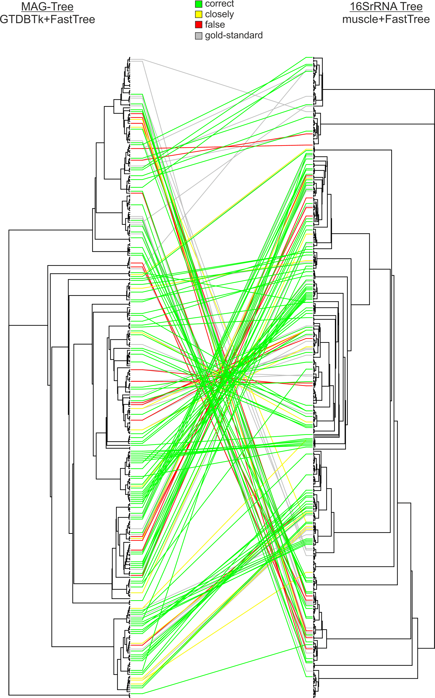

# Evaluation of Linking of reconstructed 16S rRNA genes to MAGs (CAMI2 data)

## Table of Contents  
[Description](#Description)  
[Requirements](#Requirements)  
[Gold-Standard-Creation](#Gold-Standard-Creation)  
[Results](#Results)  
  

# Description

We evaluate the linking approach on simulated data. We use the 2nd CAMI Toy Mouse Gut Dataset (Fritz et al., 2019, PMID: 30736849) following our original pipeline. 

In brief we perform a pooled assembly of all 64 samples with MegaHIT, followed by a binning of contigs with metaBAT to MAGs (n=438). RAMBL was using to reconstruct 16S rRNA gene sequences (n=460). 
Gold standard (MAG -> RABL-16S-sequence) were created by mapping MAGs to reference genomes with FastANI. Reference genomes were assigned to reconstructed 16S rRNA sequences using BlastN (min ident 97% and min coverage 100bp). 
204 MAGs reaching the quality criteria (CheckM completeness -contamination <= 80%) and of 163 it was possible to assign a reconstructed 16S rRNA sequence. 
Our linking approach predicted for 103 (63.2%) MAGs the best possible reconstructed 16S rRNA gene sequence (gold standard agreement). From the remaining 60 connections, 29 were filtered out by agreement of the taxonomic classification (disagreement on family level). These connections were replace by predictions of our linking approach (RAMBL-16S to MAGs). This step map 6 additional MAGs to the correct 16S rRNA gene sequence. Resulting final correct mappings are 109 of 163 (66.9%), for 23 (14.1%) no predictions were possible, 31 (19%) are incorrect links. For 15 of these 31 links represent closely related hit to the gold standard, the remaining 16 connections (9.8%) are distinct to the gold standard.

# Requirements

* [NCBI Blast](http://ftp.ncbi.nlm.nih.gov/blast/executables/blast+/LATEST/)
* [FastANI](https://github.com/ParBLiSS/FastANI)
* [GTDBTk](https://github.com/Ecogenomics/GtdbTk)
* [Sina-Silva 16S rRNA classifer] (https://www.arb-silva.de/aligner/)
Created by linking pipeline see README.md
* predicted links of mMAGs to RAMBL 16SrRNA sequences
* predicted links of RAMBL 16SrRNA sequences to MAGs

# Gold-Standard-Creation

**1. Create conducted fasta for ref genomes**

	for i in ./CAMISIM_MG/ref-genomes/*.fa
	do
	SampleName=${i##*/}
	SampleName=${SampleName%.fa}
	echo ">${SampleName}" >> combi-cat-ref.fasta
	cat $i | fgrep -v ">" >> combi-cat-ref.fasta
	echo $SampleName
	done
	

**2. Create Blast database with reconstructed 16S rRNA sequences from RAMBL**

	# RAMBL constructed sequences were ordered by muscle and renamed
	makeblastdb -in rambl-16SrRNA.fasta

**3. Blast MAGs to RABL-16S-sequences with blastn**

	cores=24
	blastn \
	-db rambl-16SrRNA.fasta \
	-query combi-cat-ref.fasta \
	-max_target_seqs 50 \
	-outfmt 6 \
	-evalue 0.000001 \
	-num_threads $cores \
	-out blast-refGenomes-to-mgCAMI16S.outfmt6

**4. Filter Blast output**

	#filter for 97% identity and minlenghts of 100bp
	cat blast-refGenomes-to-mgCAMI16S.outfmt6 | \
    awk '$3 > 97' | awk '$4 > 100' | cut -f1,2,12 > filtered-BlastOut.tab
	#select first best hit for gold-standard > 163 mappings for MAGs (CheckM completeness -contamination <= 80%)

**5. Manual filtering for linking predictions by taxonimic overlap on family level

For predicted links of mMAGs to RAMBL 16SrRNA sequences: We compaired taxonomy of MAGs and the linked 16SrRNA sequence. Disagreements on family level were filtered out. In the simulated dataset the taxonomy is known, in a real dataset 16SrRNA genes can be assigned with silve-sina-classifer and MAGs with GTDBTk. 
Filtered links were repleaced with the predicted links of RAMBL 16SrRNA sequences to MAGs.

# Results

Our linking approach predicted for 103 (63.2%) MAGs the best possible reconstructed 16S rRNA gene sequence (gold standard agreement). From the remaining 60 connections, 29 were filtered out by agreement of the taxonomic classification (disagreement on family level). These connections were replace by predictions of our linking approach (RAMBL-16S to MAGs). This step map 6 additional MAGs to the correct 16S rRNA gene sequence. Resulting final correct mappings are 109 of 163 (66.9%), for 23 (14.1%) no predictions were possible, 31 (19%) are incorrect links. For 15 of these 31 links represent closely related hit to the gold standard, the remaining 16 connections (9.8%) are distinct to the gold standard.

**1. Cophyloplot of mMAG tree and 16S-rRNA sequences**

MAG tree was geneated with GTDBTk and FastTree. 16S rRNA tree bulit by mucle and FastTree.

* green lines for correct links
* yellow lines for closey releated hits-fasta
* red for false preditions
* grey for gold-standard links

